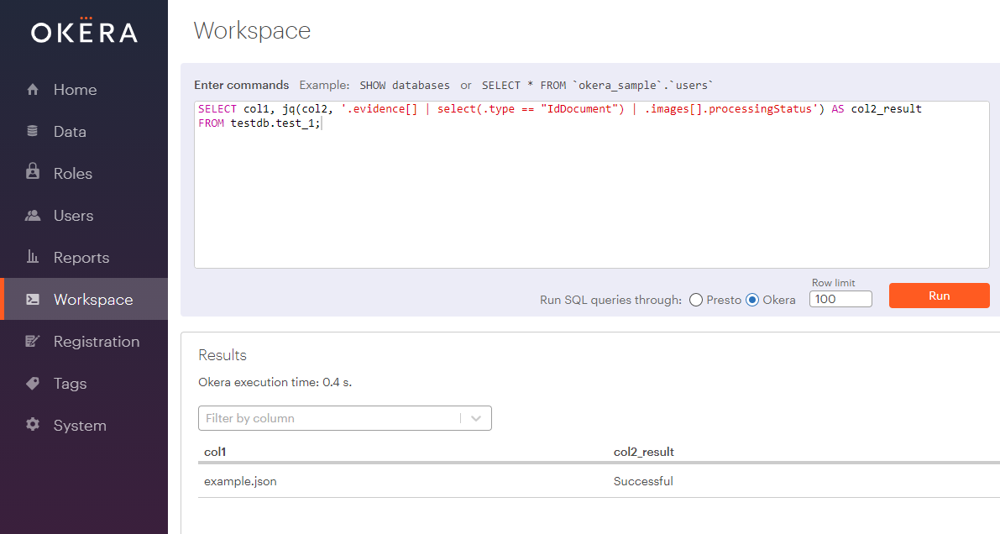

# Okera Hive UDFs

This project creates a single JAR with extra/additional UDF functions that can be used with Okera's ODAP.

## Building

Check out the code and run 

```
$ mvn package
```

to build an uberjar with everything you need. 

## Contained UDFs

The following UDFs are part of this project.

### `jq` Function

This function provides access to JSON Query (JQ), which is a common CLI tool to extract information from a given JSON structure using a specific query language.
See https://stedolan.github.io/jq/tutorial/ for examples.

The function has the following form:

```
STRING jq(<json_string>, <jq_string>)
```

Both parameters must be literals or column references that result in `STRING` types.
The result is also a `STRING` type, containing what the `jq` query has returned.

## Examples

This section contains steps to run the UDFs in Okera.

### `jq()` Example

These are the steps to get the function to work and apply it to the supplied example JSON:

1. Follow the instructions under [Building](#Building) to produce the JAR file for the UDF(s)

2. Create a test file in Parquet format, by running the following from the project root directory:

    ```sh
    $ pip3 install -r requirements.txt
    $ python3 src/test/python/create_parquet.py
    ```

    This will create a file called `example.parquet` in the root directory of the project.

3. Create a dataset in an S3 bucket

    For example, use something like this AWS CLI code:

    ```sh
    $ BUCKET_NAME="<bucket_name>"  
    $ aws s3 cp example.parquet s3://$BUCKET_NAME/datasets/example1/
    ```

    Note: Replace `<bucket_name>` with an S3 bucket name you have read and write access to.

4. Register the dataset in the Okera WebUI using the Workspace tab

    Copy and paste (as well as amend as needed) the following DDL:

    ```sql
    CREATE DATABASE IF NOT EXISTS testdb;
    DROP TABLE IF EXISTS testdb.example1;
    CREATE EXTERNAL TABLE testdb.example1 (
      col1 STRING COMMENT 'Name of the example file used', 
      col2 STRING COMMENT 'JSON provided by the example file'
    )
    COMMENT 'Test JSON Query'
    STORED AS PARQUET
    LOCATION 's3://<bucket_name>/datasets/example1'
    ```

    Note: Replace `<bucket_name>` with the S3 bucket name you have used in the previous step.

5. Copy the UDF JAR to an S3 bucket

    From the project root directory use something like this AWS CLI code:

    ```sh
    $  aws s3 cp target/hive-udfs-1.0-SNAPSHOT.jar s3://$BUCKET_NAME/udfs/hive-udfs-1.0-SNAPSHOT2.jar
    ```

    Note: This reuses the same bucket as before, but can of course be set to something different as well.

6. Register the UDF in the Okera WebUI using the Workspace tab

    Copy and paste (as well as amend as needed) the following DDL:

    ```sql
    DROP FUNCTION IF EXISTS testdb.jq(STRING, STRING);
    CREATE FUNCTION testdb.jq(STRING, STRING) RETURNS STRING
    LOCATION 's3://<bucket_name>/udfs/hive-udfs-1.0-SNAPSHOT2.jar'
    SYMBOL='com.okera.hive.extras.udfs.JsonQueryUDF';
    ```

    Note: Replace `<bucket_name>` with the S3 bucket name you have used in the previous step.

7. Query the data using the UDF in the WebUI using the Workspace tab

    For example, query the JSON to find a specific value of a nested key:

    ```sql
    SELECT col1, testdb.jq(col2, '.evidence[] | select(.type == "IdDocument") | .images[].processingStatus') AS col2_result
    FROM testdb.example1;
    ```

    This will yield something like the following:

    